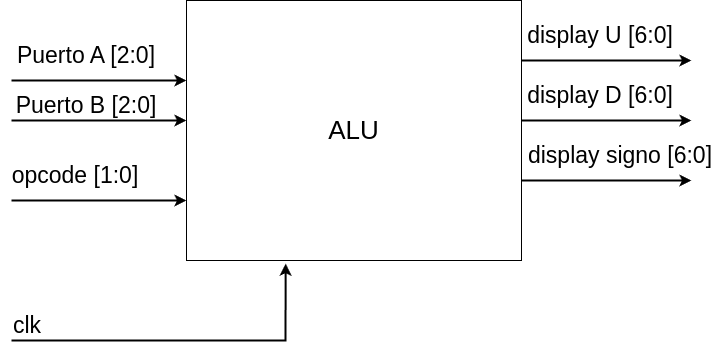
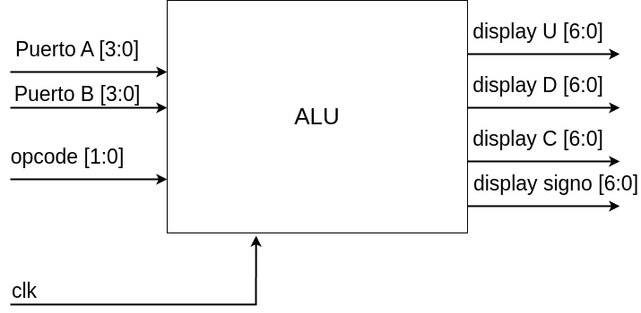

# Lab05: ALU

## 1. Objetivos de aprendizaje

* Diseñar e implementar una ALU de 3 bits o 4 bits con múltiples operaciones aritméticas y lógicas.

* Comprender cómo una ALU procesa diferentes operaciones según señales de control.

* Sintetizar e implementar el diseño en una FPGA mediante un lenguaje de descripción de hardware (HDL).

* Validar el correcto funcionamiento de la ALU mediante simulación y pruebas en hardware.

## 2. Fundamento teórico
### 2.1 ¿Qué es una ALU?

La ALU (Unidad Aritmético-Lógica) es un componente central en la arquitectura de cualquier procesador. Es responsable de realizar operaciones aritméticas (como suma, resta y multiplicación) y lógicas (como AND, OR, XOR, NOT) entre operandos binarios.

En este laboratorio, la ALU operará sobre dos operandos de 3 bits o 4 bits (A y B) y cada operación aritmética es ejecutada acuerdo al código de la operación (```opcode```).

### 2.2 Diagrama de caja negra

#### Para 3 bits:

 <p align="center">
 
</p>


#### Para 4 bits:

 <p align="center">
 
</p>

## 5. Entregables

1. Documente su descripción de hardware de la ALU en su respectivo archivo ```README.md```.

2. Realice la implementación de la ALU en la correspondiente tarjeta de desarrollo y muestre las respectivas evidencias en clase.

3. Adjunte las evidencias en su respectivo repositorio en Github classroom.